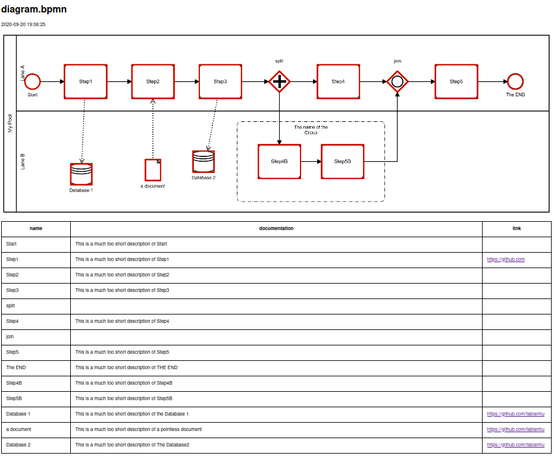

# BPMN2HTML
This is a converter from [Camunda BPMN](https://camunda.com/download/modeler/) to [HTML](diagram.html) 
to enable viewing without any extra tool.

Includes a clickable map and a list of the documentation, which is not visible in the image alone.

## Usage
* Create a model of your favourite business process in [camunda modeler](https://camunda.com/download/modeler/)
* In the Properties Panel fill the "General - Documentation" field of an element
* Use "Extensions - Properties - Add" property with name "link" to add a link to external target or documentation
* Save as .bpmn file to a known location
* Export as image (.png) into the same directory (required)
* Run [BPMN2HTML](bpmn2html.py) in this directory, it will convert all .bpmn files, which have a .png with equal name

## Output is a simple HTML page with
* Original image on top
* Downsized image as with HTML image map and highlights in red
* Mouse-over with the "Documentation" content of the model of every highlighted element
* List of all Items in file - sequence 
    * "Documentation" content of the model
    * link with the content of the camunda:property with name="link" 

## TODO
* process in arrow-sequence, not in file-order
* support sub-processes

